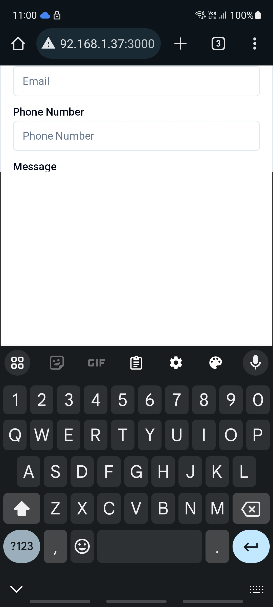

Reproduction repository for Vaul Shadcn mobile based issues

See issues

- https://github.com/emilkowalski/vaul/issues/294
- https://github.com/shadcn-ui/ui/issues/2849

To start the project, run the following commands:

```bash
pnpm install

pnpm dev # for vite dev server

pnpm build
pnpm start # for production build served with vite
```

See repro

